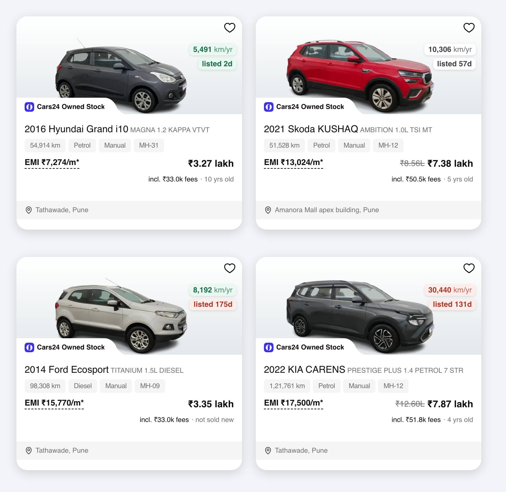

# Cars24 Card Enricher

A userscript that adds four things to every car card on [cars24.com](https://www.cars24.com):

1. **How much of the price is fees** — not the car, the paperwork.
2. **How much cheaper it is than buying that model new** — but only when that comparison is honest.
3. **How hard the car has been driven** — kilometres per year, not just total odometer.
4. **How long it has been up for sale** — a car that has sat for months is negotiable.



---

## Why bother?

Cars24 quotes you **₹7.38 lakh** and, in small grey letters underneath, `Includes RC transfer & more`.

"& more" is doing a lot of work there. On that car it is ₹50,474 — RC transfer, third-party
insurance, a 12-month warranty and pre-sale servicing. The car itself is ₹6,87,339. Across the cars
I sampled the fees run **₹33,000 to ₹75,000**. Nothing on the card tells you which part is which,
and you cannot negotiate what you cannot see.

This script does the split for you:

```
before        ₹8.56L   ₹7.38 lakh
              Includes RC transfer & more

after         ₹8.56L   ₹7.38 lakh
              incl. ₹50.5k fees · 5 yrs old
```

Hover it for the itemised version:

> Car ₹6,87,339 + ₹50,474 fees = ₹7,37,813 — incl. RC transfer price ₹10,000,
> Third party insurance ₹2,474, Extended Warranty – 12 Months ₹27,000, Car Servicing Charges ₹11,000

Same numbers the site's own price popup shows. You just don't have to open it on every car.

---

## The four things it shows

### 1. The fee split

Appears on **every** card, straight from the endpoint the site's own popup uses — so it is not an
estimate.

Cars24 has advertised prices both ways, so the script works out which one you are looking at rather
than assuming. It used to quote the car alone and hide the fees behind a `+ other charges` link;
today the headline already includes them. Either way you get the number that is missing: the fee
slice when it is baked in, or `₹12.00L all-in` when something is genuinely still owed on top (some
cars add tax collected at source, for instance). It never just repeats the price you can already
see.

### 2. "% off new" — and why it is often missing

This is the honest bit, and it needs explaining, because you will notice it is blank a lot.

The idea sounds simple: look up what that model costs new today, subtract, show the gap. In practice
that produces nonsense, for two reasons.

**Car prices creep up every year.** A 2022 Honda City works out at "53% off" a new City. But a
four-year-old car has not lost half its value — Honda has simply raised the price of a new City a
lot since 2022. Most of that "discount" is inflation wearing a disguise. A 2015 City computes as 73%
off, which is even more meaningless.

**Some catalogue pages are fiction.** `cars24.com/new-cars/volkswagen/polo/` loads perfectly and is
titled "Volkswagen Polo Price in India 2026". Volkswagen stopped selling the Polo in India in 2022.
The page offers two trims — "Base Variant" at ₹8,00,002 and "Top Variant" at ₹14,00,000 — which are
placeholders, not cars you can buy. The page even claims `isDiscontinued: false`. Around 30 models
have pages like this. Trust them and you will confidently tell someone they are getting 58% off a
price that does not exist.

So the script only shows a percentage when it can stand behind it:

- the model is really still on sale (a genuine 404 means it is not — placeholder trims count as
  not-on-sale too);
- a specific trim matches, with the same fuel and gearbox;
- the saving is believable for the car's age — roughly 30% in year one, creeping to a 40% ceiling.
  Anything above that says more about years of price rises than about this particular car, so it is
  dropped.

Fail any of those and you get the plain facts instead — the car's age, or `not sold new`. **No
number is better than a wrong number.** Expect the percentage on recent cars; older stock mostly
shows its age instead.

When it does appear, it compares like with like: your city's on-road price against the used car's
true total, both including taxes and registration.

### 3. km per year

`58,802 km` means very different things on a 2013 car and a 2021 one. The pill under the wishlist
heart divides by the car's age so you can judge it at a glance:

- **green** — under ~9,000 km/yr, an easy life
- **grey** — normal, around the 12,000 km/yr Indian average
- **red** — over ~17,000 km/yr, this one has worked

### 4. Days listed

A second pill under the first, showing how long the car has been on sale:

- **green** — under 14 days, fresh stock
- **grey** — a few weeks, normal
- **amber** — over 60 days, it has been sitting

This one is worth knowing before you talk money. A car listed 175 days ago has had six months of
people walking away from it; one listed yesterday has not.

Cars24 tracks this and never shows it. The catalogue API returns a `firstListingTime` per car, and
you can prove it means what it says: sort the site by its own **Recently Added** and read the field
back, and the sequence is perfectly monotonic across every card — it is the column that sort runs on.
So this is an exact date, not an estimate.

The numbers are real ones, not derived: observed ages on a single Pune page ran from 2 days to 175.

---

## Installing

1. Install [Tampermonkey](https://www.tampermonkey.net/) (Chrome, Firefox, Edge or Safari).
2. Open [`cars24-card-enricher.user.js`](cars24-card-enricher.user.js), click **Raw**, and
   Tampermonkey will offer to install it.
3. Go to [cars24.com](https://www.cars24.com) and browse. Cards fill in as you scroll.

Nothing to configure.

---

## Things worth knowing

**It only reads.** No clicking, no forms, no account. Everything comes from public pages and the
same endpoint the site's own price popup uses. It never sends your data anywhere.

**It is polite.** Four requests in flight at most, with a small gap between them, and results are
cached in your browser — prices for a day, new-car data for a week, listing dates for a month.
Days-listed is asked for in batches, so a screenful of 20 cards costs one request, not twenty. A
car's first-listed timestamp never changes, so it is fetched once and the day count recomputed
locally after that. Scrolling back over cars you have already seen costs nothing.

**If it can't reach the network, it gets out of the way.** No error toasts, no broken layout: the
card just looks like it always did, with the site's own strapline untouched.

**Nothing moves.** The text goes into the slot that strapline already occupies — a fixed 19px, inside
a fixed-height card that clips overflow. Adding a line would push the hub location out of view, so it
replaces rather than appends. Card heights never change and the grid never shifts.

**Cards it skips.** Where Cars24 marks a price negotiable (private seller listings), there is no
fixed total to break down, so it leaves those alone.

---

## When it breaks

Cars24 is a live site and it changes — it already has once since this was written. The advertised
price used to be the car alone with the fees hidden behind a `+ other charges` link; now the fees are
baked into the headline and the strapline reads `Includes RC transfer & more`. The `showOtherCharges`
flag flipped to `false` and `totalExtraCharges` started reporting `0` at the same time.

That is why the script measures the advertised price against the true total instead of trusting
either flag. If Cars24 flips back, it follows without a code change.

Likely failure modes:

- **The fee figure stops appearing.** The charges endpoint or its headers changed. The script fails
  quietly by design, so the card just reverts to normal.
- **The figure looks wrong or repeats the price.** The script could not read the advertised price off
  the card. It reads the last price in the block, skipping any struck-through "was" price.
- **"% off new" disappears everywhere.** The new-car pages changed shape. Two payload formats exist
  today — some pages inline all their data, some use back-references — and the parser handles both,
  but a third would need work.
- **Days-listed stops appearing.** The catalogue API dropped `firstListingTime`, or the batch
  endpoint moved. Nothing else depends on it, so the rest of the card carries on. Note the field
  returns timestamps both with and without milliseconds in the same response, so it is parsed with
  `Date.parse` rather than anything that assumes a fixed width.

Set `debug: true` at the top of the script and the console will tell you why each card decided what
it did (`too-good-to-be-true`, `variant-unmatched`, `discontinued`, and so on).

Model names are the other soft spot. Cars24's used listings and new-car catalogue do not always
agree — used "Wagon R 1.0" versus catalogue `wagon-r`, "Grand i10" versus `grand-i10-nios`. There is
a small alias table near the top of the file; add to it as you spot gaps.

Some misses are deliberate. An "XUV300" listing is the pre-2024 car, before Mahindra renamed it
XUV 3XO — so it is *not* aliased to the new name, because comparing them would compare two different
cars. Same for "Elite i20". These show `not sold new`, which is the truthful answer.

---

## A note on the numbers

Everything factual here was checked against live pages, not assumed:

- The fee figures were verified against live listings: base price plus the itemised charges equals
  the stated total, every time. Note that the API's own `totalExtraCharges` field now reports `0`
  even when the charge lines are populated, so the script derives the total itself rather than
  trusting it.
- The percentage's age ceiling was tuned against real listings so that plausible savings (Creta 17%,
  Swift 22%, Kylaq 24%, Punch 27%, i20 38%) pass, and inflated ones (Slavia 47%, City 49%, City 53%)
  are rejected — with margin on both sides rather than a knife-edge fit.
- The "% off new" figure lands on a minority of cards. That is the intended outcome, not a bug.

---

## Licence

MIT. Do what you like with it.
