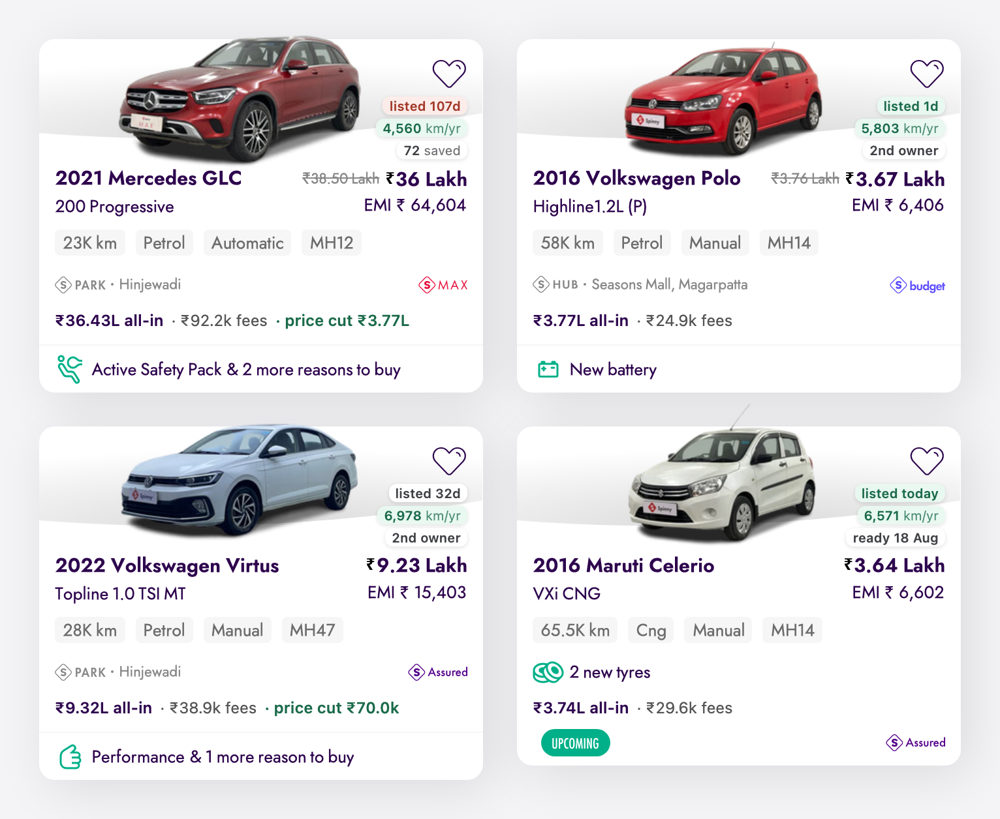

# Spinny Card Enricher

A userscript that fixes two things about every car card on [spinny.com](https://www.spinny.com):

**It removes two adverts.**

1. The pink discount pill over the top-left of the photo — `₹20,000 ↓`.
2. The `Save extra ₹26.6K on` banner wrapped around the EMI figure.

**And it adds five facts.**

3. **What the car actually costs all-in** — and how much of that is fees rather than car.
4. **Whether the price has already been cut**, and by how much.
5. **How hard the car has been driven** — kilometres per year, not just total odometer.
6. **How long it has been listed** — from the field Spinny's own "Newest First" sort runs on.
7. **How many people have shortlisted it**, plus **how many owners it has had** and **when it will be
   ready** if it is still in refurbishment.



---

## Why bother?

Spinny quotes you **₹3.64 Lakh** for a 2016 Celerio. You will pay **₹3,74,345**.

Nothing on the card says so. The gap is ₹10,277 — RC transfer facilitation ₹4,000, insurance ₹2,932,
GST ₹3,345 — all of it mandatory, none of it optional. And of the ₹3.64 Lakh you *were* quoted, only
₹3,44,783 is the car; the rest is a servicing bundle and a warranty.

So the real split is:

```
car                ₹3,44,783
fees inside        ₹19,285     servicing, FASTag, fuel, warranty
fees on top        ₹10,277     RC transfer, insurance, GST
                   ─────────
you pay            ₹3,74,345
card says          ₹3,64,068
```

The script does that arithmetic on every card:

```
before      ₹3.76 Lakh   ₹3.64 Lakh
            VXi CNG                      EMI ₹ 6,602

after       ₹3.76 Lakh   ₹3.64 Lakh
            VXi CNG                      EMI ₹ 6,602
            ₹3.74L all-in · ₹29.6k fees
```

Hover it for the itemised version:

> Car ₹3,44,783 + ₹29,562 fees = ₹3,74,345 all-in.
> The card shows ₹3,64,068, so ₹10,277 is still owed on top — RC transfer facilitation ₹4,000,
> Insurance ₹2,932, GST (govt. taxes) ₹3,345.
> Inside the shown price: Servicing, FASTag, fuel & more ₹8,700, Warranty (Protect) ₹10,585,
> Fixes & upgrades (included).

Same numbers Spinny's own price popup shows. You just don't have to open it on every car.

This is not one unlucky listing. Across **5,086 cars in 21 cities**, every single one had fees baked
into the headline *and* more money owed on top of it:

| | min | p25 | median | p75 | max |
|---|---|---|---|---|---|
| fees, total | ₹10,510 | ₹24,725 | **₹28,973** | ₹35,642 | ₹1,04,842 |
| of which owed on top of the price shown | ₹4,810 | ₹7,705 | **₹10,837** | ₹13,398 | ₹75,262 |
| fees as % of the price shown | 1% | 4% | **5%** | 7% | 20% |

Spinny does admit this on a car's own page, where the price carries a small
`+On-road charges & taxes`. On the listing grid it says nothing at all.

---

## The two things it removes

### The discount pill

`span.CarListingCardV2__specialOfferBadgeWrapper` — a pink pill absolutely positioned to straddle the
top edge of the card, showing the current sale discount. It is driven by `discount_v3.value` and it is
the same number as the gap between the struck-through price and the headline, so it is the third time
one fact is stated on one card.

It is hidden in CSS, not deleted. React re-renders these cards on scroll, hover and pagination, so a
removed node comes straight back.

### The "Save extra" banner

`span.LoanDiscountSavings__savingsWithLoanCampaign`. This one needs care, because it is **not** an
overlay — it is the first flex child of the `<li>` that also contains the EMI figure. Hide the `<li>`
and you lose the EMI.

So the script hides only the banner, and then clears the pink gradient border, the left-rounded corner
and the promo text colour that Spinny paints onto the EMI row to match it. Otherwise you get a pink
box with nothing in it.

Worth knowing what the number was: `finance.best.details.savings`, the interest you would save over
the loan term at Spinny's campaign rate versus their standard one. It is not money off the car, and it
only exists if you finance through them.

The struck-through pre-sale price is left alone, since you asked for the pill and the banner. If you
want it gone too, set `hideSlashedPrice: true` at the top of the script.

---

## The five things it adds

### 1. The all-in price and the fee split

On **every** card, computed from the same itemised breakdown the site's own price popup reads.

Spinny ships two breakdowns — `price_breakdown_v2` and `price_breakdown_v3` — and they use the same
field names for different quantities. v3 splits RC transfer and insurance into their own list; v2
folds both into the servicing bundle. Each pairs with its own discount object, and the two disagree on
exactly one field, by exactly that RC-and-insurance total. Pair them across versions and the headline
moves silently.

Which one a card renders depends on `procurement_category`: luxury cars get v2, everything else v3.
Rather than test the category, the script computes both and keeps whichever reproduces the price
actually printed on the card. That is also how it decides which fees are inside the headline and which
are on top, because Spinny has shipped the price both ways and gates the choice on a per-user
experiment flag. Measure, don't assume.

If no candidate matches the card, the script prints nothing. That is the failure mode you want.

### 2. Price cut

`price cut ₹70.0k` when Spinny has marked the car down.

This is the one thing here that Cars24 structurally cannot offer. `price_breakdown_v2` keeps the
previous price alongside the current one — Spinny's own labels for the three lines are `Subtotal`,
`Price drop` and `Final payable amount` — and it moved the *base* price, not the fees, so it is a
genuine markdown rather than a coupon. It is referenced by none of the 39 scripts the site loads: they
carry the number and never show it.

Fires on **35%** of a city's cards, at a ₹10,000 floor. Median cut ₹44,478; the largest found was
₹6,46,520 off a 2021 Skoda Superb.

Read it next to days-listed. The cut is mostly a function of how long the car has been sitting —
across cars whose true listing date was measured, 15 of 17 listed under 30 days had no cut, and 19 of
21 listed over 30 days did. Because the default sort is newest-first, you will see no cuts at all on
the first screenful and plenty by the last.

**No date is claimed.** `current_price_data.created_on` dates the last repricing, not the cut, and its
distribution is identical on cars that were cut and cars that never were — median 5.4 days against
5.5, even on a car that has been listed 522 days. So it cannot carry the claim and isn't used.

### 3. km per year

`58,032 km` means very different things on a 2013 car and a 2021 one. The pill divides by the car's age:

- **green** — under ~9,000 km/yr, an easy life
- **grey** — normal, around the 12,000 km/yr mark
- **red** — over ~17,000 km/yr, this one has worked

It divides by `registration_year`, not `make_year`, for two reasons: the odometer starts running at
registration, and registration year is what the card itself prints at the top. The two disagree on
about one car in eleven, always by a single year, and always on young cars where the denominator is
small enough to matter — up to a 5,769 km/yr swing, which is the difference between "gentle" and
"hard-used" on a 2023 car.

### 4. Days listed

`listed today` / `listed 32d` / `listed 107d`, coloured green under 14 days and amber over 60.

The field is `added_on`, and earning the right to print it took some work.

The obvious candidate is `latest_publish_date`, which is on every listing payload for free. It is
wrong. It is a *republish* timestamp, and it fails bimodally: on most cars it lands within ten seconds
of the true date, so a spot-check looks perfect — and then a car that has been on Spinny for 232 days
reports 38. One car in a whole city's inventory had been listed 522 days; `latest_publish_date` capped
out at 38 across the entire city.

`added_on` is the real thing, and the proof is the same one the Cars24 script uses for its own
equivalent: Spinny's "Newest First" sort option is literally `o=-added_on`, and the order that sort
returns is strictly monotonically decreasing in `added_on` across every card, zero violations — while
`latest_publish_date` breaks the order in seven places. Spinny's own analytics code calls the field
`listingDate` and derives a `tat` ("turnaround time") from it.

It is not on any of the batched endpoints, only on a car's own page-data route, so **this is the one
request the script makes per card** — about 27 KB gzipped, and a first-listing date cannot change, so
it is cached for a month and the day count recomputed locally. Set `showAge: false` if you would
rather not pay for it.

Spinny rounds this up; the script rounds down. A car added four hours ago was listed today.

### 5. Saved, owners, and ready-by

Three smaller pills, of which at most one shows — the card only has 52 measured pixels of room between
the wishlist heart and the title, which is three pills, so the least informative one gives way.

**`72 saved`** — the shortlist count. Unlike Cars24, Spinny publishes a raw count rather than rounding
to the nearest ten, so it is printed verbatim. It is also a weaker signal than it looks: across a whole
city it correlates with days-listed at rho 0.89, so it is largely an age proxy. 532 saves on a car
listed 303 days means a lot of people looked and passed. That is why it is the pill that gets dropped
first, and why the tooltip says so.

**`2nd owner`** — shown only above one owner, so on about 13% of cards. The card is *passed*
`no_of_owners` and uses it for exactly one thing: printing "Unregistered" instead of the RTO when the
count is zero. The number itself is never displayed, though it moves resale value more than most of
what is.

**`ready 18 Aug`** — for cars still in refurbishment. Spinny badges these with a wordless `UPCOMING`
icon: you are told the car isn't ready, never when. `available_on` is an exact datetime.

---

## What it deliberately does *not* show

The Cars24 version of this script shows **"% off new"** — how much cheaper a car is than that model
new. Spinny appears to hand you the same thing for free, in a per-car field called `on_road_price` that
looks exactly like the on-road price that trim cost when new.

It is not, and finding out took 5,086 cars across 21 cities plus archived price lists.

**What the field actually is:** it is keyed to the *variant name*, and its vintage is whenever that
name was last priced. If the name is still on sale, the value is **today's** new price — checked
against two independent outside sources, Hyundai Grand i10 Nios Sportz came out within 0.2%, MG Hector
Sharp within 0.4%, Venue SX (O) within 0.1%. If the name has been retired, the value is frozen at
whenever it was retired.

That is fatal, because it means for **half the inventory the field is today's new price** — 28 of 56
comparable cards sit within ±11% of it, and 22 of those cars are four or more model years old, up to
fifteen. That is precisely the contaminated quantity the Cars24 README warns about ("most of that
'discount' is inflation wearing a disguise") — except with no age ceiling and, worse, no per-card
signal telling you which half you are in. **22 of 65** populated cards would print above the 40%
ceiling Cars24 enforces; five above 50%.

It also explains why the field looks so convincing at first. For long-dead nameplates the frozen
snapshot lands near the era of the only cars that ever wore that name, so it is accidentally right.
It breaks precisely on the nameplates that survived.

The corroborating damage, all measured:

- **It is not keyed to the trim.** Of the groups sharing one make, model, variant and year, **31.5%**
  have the field populated on some cars and `null` on their identical twins. A catalogue lookup cannot
  do that.
- **The denominator depends on capitalisation.** An Alto 800 `"Lxi"` is measured against ₹3,90,000 and
  an Alto 800 `"LXi"` against ₹3,63,000. Both have 2016 cars. A 2019 Baleno `"Delta 1.2"` gets
  ₹7,00,000 and a 2019 Baleno `"Delta"` gets ₹7,95,000 — same trim, same year, an 11.7-point swing in
  the printed percentage decided by which string the listing happens to carry.
- **It is trim-inverted.** 2021 Tata Tiago: `XT` = ₹7,15,000 but `XZ` = ₹6,41,000. XZ is the *higher*
  trim.
- **It moves the wrong way with year.** Alto 800 LXi reads ₹3,90,000 for 2013–2016 and ₹3,63,000 for
  2016–2019. New cars do not get cheaper.
- **It is not fuel- or gearbox-keyed either.** One Ford EcoSport figure covers a diesel manual *and* a
  petrol automatic.
- **The error does not even have a stable sign.** A 2025 Fronx reads 8.8% *above* Spinny's own current
  price, because small-car prices fell after the September 2025 GST cut.

The worst provable case: a 2016 Honda Amaze 1.5 VX i-DTEC would print **"61.4% off new"** against
₹11,02,900. A March 2016 press report caps the *entire* Amaze range at ₹8.19 lakh ex-showroom, so the
true when-new on-road cannot exceed ₹9.6 lakh. The field overstates by at least 15%, and exceeds the
top of that whole model line by 35%.

And Spinny already makes this comparison itself, in a perk line that sorts to the front of the card's
own footer — *"Priced ~₹10.5 lakhs lower compared to it's original new car on-road price."* On 15 of
the 25 cars carrying it, our figure would contradict theirs on the same card.

The last thing tried was to rescue it with a gate — require the figure to be provably frozen rather
than current, the variant string to be canonical, the trim to match a live catalogue page on fuel and
gearbox, and Cars24's age ceiling on top. Assembled honestly, that predicate keeps **0 of 626** cards
in Pune. There is no version of this pill that survives its own suppression rules.

**No number is better than a wrong number.** So that slot carries the price cut instead, which is
exact.

Two other tempting fields, rejected for the same reason:

- **`market_price`** is `price × 1.10`–`1.13` — a fixed markup, not a valuation. Printing "₹40k below
  market" would launder marketing as signal, which is the sort of thing this script exists to strip.
- **`base_warranty_cost`** varies from ₹3,193 to ₹32,490 and looks like a risk signal. It correlates
  with age at **−0.33** — the wrong sign. It prices brand and engine, not this car. It appears only as
  a fee line, which is what it is.

---

## Installing

1. Install [Tampermonkey](https://www.tampermonkey.net/) (Chrome, Firefox, Edge or Safari).
2. Open [`spinny-card-enricher.user.js`](spinny-card-enricher.user.js), click **Raw**, and
   Tampermonkey will offer to install it.
3. Go to [spinny.com](https://www.spinny.com) and browse. Cards fill in as you scroll.

Nothing to configure.

---

## Things worth knowing

**It only reads.** No clicking, no forms, no account. Everything comes from public endpoints and the
same breakdown the site's own price popup uses. It never sends your data anywhere.

**Most of it is free.** Spinny renders no cards server-side — every one arrives by XHR. The script
listens to that call and gets the full car object for every card at no network cost of its own. That is
why it runs at `document-start`: the first listing request lands about 700 ms later, and the app bundles
are `async` scripts at the tail of a 1.8 MB document, so the tap is in place long before anything can
call through it. If it ever misses one, React's own fiber still holds the car object on the card node,
one hop down.

It listens to `fetch` as well as XHR, because a car's own page pulls its similar-cars payload that way
(`/v3/api/search/listing/<id>/related/v5`) — but that is belt-and-braces. In testing, that strip never
actually rendered card components, so the script is verified on listing and search pages only. Where
cards do appear, they appear with the same class names, and it would pick them up.

**It is polite.** Four requests in flight at most, with a gap between them, and results cached in your
browser. The shortlist count and ready-by date come from one batched request per 40 cards — the
endpoint the site itself calls drops those fields, but an older version of it answers the same query
with them, and honours an undocumented `ids=` filter. Only days-listed costs a request per car, and
only for cards you actually scroll to. Scrolling back over cars you have already seen costs nothing.

**`@grant none` is deliberate.** It puts the script in the page's own realm, which is the only way
patching `window.XMLHttpRequest` patches the object Spinny's bundles actually call. Any `@grant` at all
would sandbox it and the tap would go deaf.

**Nothing is overwritten.** Unlike the Cars24 card, Spinny's is not height-locked — nothing from the
grid cell down to the detail container sets a height or clips — so the fee line is *appended* rather
than written over the top of something of Spinny's. Every card grows by exactly one line, so the grid
stays even.

**One line is not clickable.** Spinny catches card clicks with a transparent overlay covering the whole
card, which also swallows every hover. The fee line is lifted above that overlay so its tooltip works;
the cost is that this one strip does not open the car. That seemed like the right trade for being able
to read the breakdown.

**If it can't reach the network, it gets out of the way.** No error toasts, no broken layout. The two
adverts still go — that part is pure CSS and needs nothing.

---

## When it breaks

Spinny is a live site and it will change.

The good news is that its class names are **not** content hashes. They are CSS-module names derived
from filenames — `CarListingCardV2__carListingCarContainer`, `LoanDiscountSavings__pill` — so they
survive deploys, and they are byte-identical between the desktop and mobile builds. Selectors are
matched on substrings where a component has both a V2 and a V3 spelling, so a version bump is handled.

Likely failure modes:

- **The fee line disappears everywhere.** The breakdown changed shape and no candidate matches the
  price on the card, so the script is refusing to guess. This is working as intended; turn on
  `debug: true` and the console will name each card it declined and why.
- **The adverts come back.** A class was renamed. Both are hidden by substring
  (`specialOfferBadgeWrapper`, `savingsWithLoanCampaign`), so it would take a real rename, not a
  reshuffle.
- **The EMI row is pink and empty.** The banner is being hidden but the row's promo skin is not. Spinny
  paints that as an *inline* gradient, so the override depends on an `!important` rule outranking it.
- **Days-listed stops appearing.** The page-data route moved or dropped `added_on`. Nothing else
  depends on it. Do not "fix" this by substituting `latest_publish_date` — see above for why.
- **The pills overlap the car's name.** The card geometry changed. The stack is sized against a
  measured 52px band between the heart and the title; `maxPills` is the knob.

One quirk worth recording, because it looks like a bug and isn't: Spinny's own check for whether a sale
is still running splits `end_time` on a `"T"` that its own space-separated timestamps do not contain,
so the expiry test never fires and a sale is "live" whenever its value is above zero. The script does
not copy the bug, but it does not enforce the intent either — if the discount is in the price the card
is showing, that price is the one that needs explaining.

---

## A note on the numbers

Everything factual here was checked against live data, not assumed:

- The price model was verified on **5,086 cars across 21 cities**. The headline the script computes
  matches the formula Spinny's own bundle uses on **5,086 of 5,086**, and the all-in total reconciles
  against an independent field on all of them.
- It reconciles *better* than Spinny's own aggregate in two places. On **45 cars**, a sale discount
  drops the base under ₹10 lakh, so the car's `adjusted_tcs` goes to zero while `listing_price` still
  carries the full 1% TCS — the script charges only what the itemised lines charge, about ₹10,000 less.
  On one car, `final_discounted_price` deducts a whole TCS instead of the part the discount removed.
- Fee line names are **not** fixed nationally: alongside TCS there is a `transfer_tax` in Gujarat,
  found only by sampling beyond one city. They are summed rather than named for that reason.
- The script was run against the live site in a real browser. On a Pune listing page it enriched every
  card it processed, hid **37 of 37** discount pills and **42 of 42** loan banners, and left every EMI
  figure intact.

---

## Licence

MIT. Do what you like with it.
